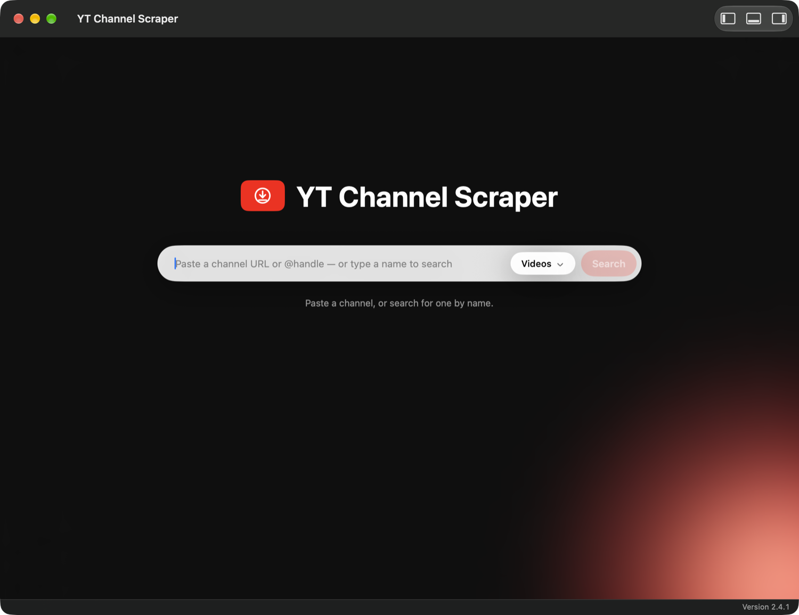
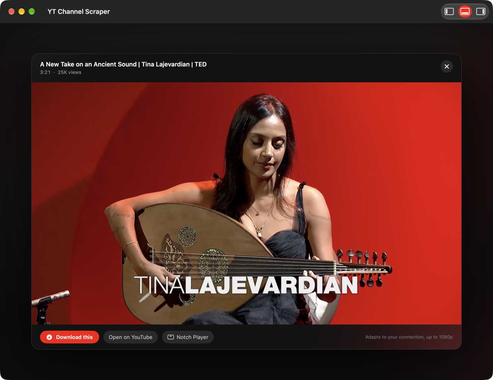
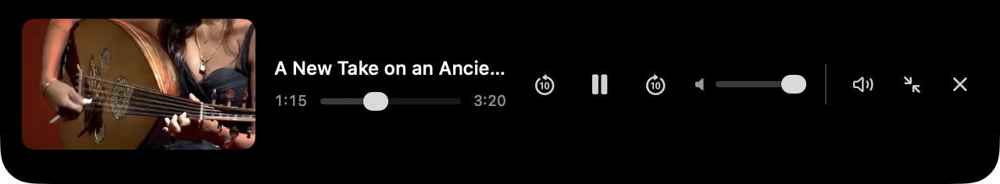
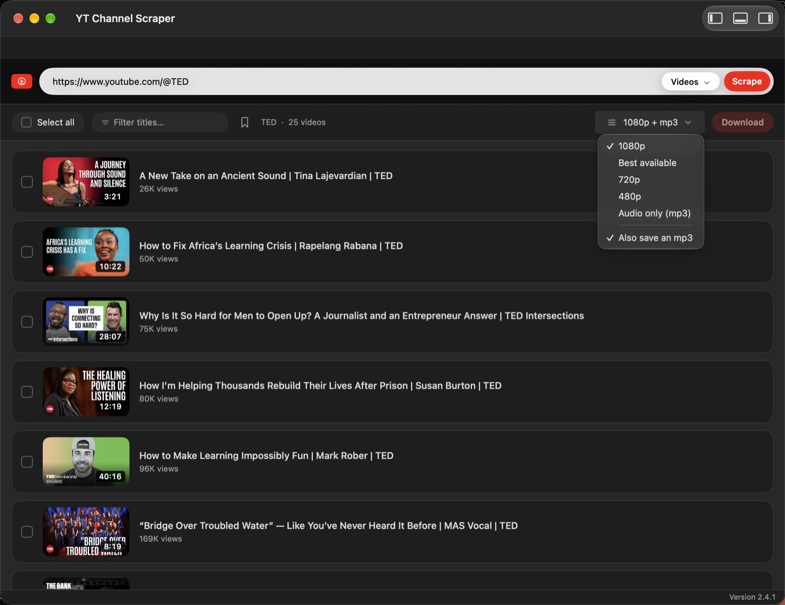
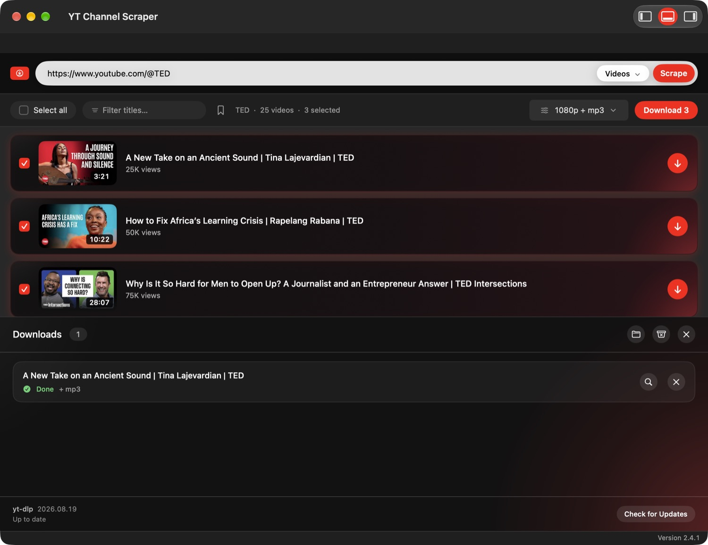

<div align="center">


# YT Channel Scraper

**Browse any YouTube channel's back catalogue in one list, tick the videos you want, and
download them in a batch — and watch them before you commit.**

A native Mac app — SwiftUI + [yt-dlp](https://github.com/yt-dlp/yt-dlp).
No account, no API key, no cloud, no browser tab.



</div>

---

## Why

`yt-dlp` is excellent, but grabbing *a few specific videos* from a channel means either
downloading everything or copying URLs one at a time. This puts the channel in front of
you as a browsable list — thumbnails, durations, view counts — so you can pick. And since
you can play anything in place, you don't have to download something to find out whether
you wanted it.

## What you get

| | |
|---|---|
| **Whole channel, one list** | Videos, Shorts, Live or Music, with thumbnails, durations and view counts |
| **Paged** | 25 at a time, so the first page lands in seconds even on a 5,000-video channel |
| **Batch download** | Tick as many as you like; 3 download at a time with live per-video progress |
| **Quality choice** | Best available, 1080p, 720p, 480p, or audio-only as 192 kbps mp3 |
| **Video and audio at once** | Tick **Also save an mp3** and each download leaves a 192 kbps mp3 beside the video — lifted out of the file you just fetched, not downloaded twice |
| **Find a channel** | Don't know the URL? Type a name and pick the channel from the results |
| **Save what you use** | Bookmark channels and individual videos; each gets a side panel that slides the page over rather than covering it, so what you were reading stays readable |
| **Bring your subscriptions** | Drop a Google Takeout `subscriptions.csv` into the saved-channels panel and every channel you follow is saved — no sign-in, no API key |
| **Watch first** | Preview any video in the app — including Shorts and live streams — without downloading it |
| **Keeps playing** | Minimise and playback moves to a mini player pinned to the notch, with its own output picker — speakers, headphones or AirPlay, one tap each |
| **Updates itself** | The app checks GitHub for a newer release, installs it, and reopens into it — no re-download, no drag to Applications |
| **Self-updating yt-dlp** | Update from inside the app; it applies to the very next action, no restart |
| **Resilient** | Steps down through cookies → JS solver → android client when YouTube gates a format |


Picked rows go dark with red light pooling in from the corner, and each one gets a
download button of its own if you only want that one.

## Requirements

- **macOS 15** or later to run
- **Xcode** (Swift 6) to build

Nothing else. There is no Python, no Homebrew dependency and no runtime install — the
build stages every binary it needs into `vendor/`.

## Build and run

```bash
git clone https://github.com/d4vid4nderson/yt-channel-scrapper.git
cd yt-channel-scrapper
./build-mac-app.sh
open "dist-mac/YT Channel Scraper.app"
```

The first build downloads four binaries into `vendor/` (~200 MB, cached — rebuilds are
offline):

| | |
|---|---|
| `yt-dlp_macos` | does the actual listing and downloading |
| `ffmpeg`, `ffprobe` | merge separate video + audio streams, and make the mp3s |
| `deno` | solves YouTube's JavaScript "n challenge" — without it every format above 360p `403`s |

A **static** ffmpeg is staged rather than Homebrew's, which links ~18 Homebrew dylibs and
so would only run on a Mac that already had it installed.

Downloads land in `~/Downloads/YT Channel Scraper`, named `Title [videoid].mp4`.

### Saved channels and videos

Three panels hang off the window, opened from the buttons in the title bar — each button is
a picture of the window with that panel out:

| Panel | Where | What |
|---|---|---|
| Saved channels | left (⌘1) | everything you have bookmarked, filterable, one click to its videos |
| Downloads | bottom (⌘2) | the queue, with per-video progress and the yt-dlp updater |
| Saved videos | right (⌘3) | videos kept across channels — preview or fetch one, or open them all as a list |

They take room from the page rather than covering it, so the list you opened them from is
still there and still usable. Nothing is dimmed, because nothing is blocked.

Bookmarking keeps things in `~/Library/Application Support/YT Channel Scraper/` —
`channels.json` and `saved-videos.json`. Saved videos list, preview and batch-download
exactly like a scraped channel's do, so a bookmark is a way of building a download queue
over several sittings.

To bring in the channels you already subscribe to, export them from
[Google Takeout](https://takeout.google.com/) (YouTube and YouTube Music → *subscriptions*),
then drop the `subscriptions.csv` onto the saved-channels panel or use **Import YouTube
Subscriptions…**. Re-importing later merges rather than duplicates. It is a snapshot, not a
live feed — that is the trade for needing no OAuth client, no app review by Google, and no
sign-in that expires. Channel pictures are not in the CSV, so they fill in quietly in the
background, two at a time, and are then kept.

### Updating the app

The version sits at the foot of the window. When a newer release is out that line says so,
and clicking it — or **Check for Updates…** in the app menu — shows what changed and offers
to install it. The app downloads the release's `.dmg`, mounts it, checks the bundle inside
is really this app and really newer, swaps it in, and reopens into the new version.

The swap is a rename rather than a write, which is what makes replacing a running app safe:
the executable this process started from stays valid until it exits.

Fetching the disk image in-process also sidesteps the thing that makes this app awkward to
hand out. Gatekeeper refuses ad-hoc-signed apps that arrive quarantined, and quarantine is
set by the browser, not by the network — so an update installed from inside the app needs
none of the Open Anyway dance a browser download does.

Cutting a release is two commands:

```bash
VERSION=2.2.0 ./build-mac-app.sh --dmg
gh release create v2.2.0 "dist-mac/YT-Channel-Scraper-2.2.0-arm64.dmg" \
  --title "v2.2.0" --notes "what changed"
```

The DMG is named for its version and architecture because that is what the updater looks
for: it reads the latest release, picks the `.dmg` matching the machine it is running on,
and compares the tag to its own `CFBundleShortVersionString`. A release with no `.dmg`
attached is simply not offered.

### Moving to another Mac

The library is per-account and local — `~/Library/Application Support/YT Channel Scraper/`
in your own home folder — so another login on the same Mac, or the same login on a
different Mac, starts empty.

**Export Library…** writes both lists to one `.ytcslibrary` file. Copy it across however you
like, then **Import Library…** on the other Mac, drop it on the saved-channels panel, or
just double-click it — the app owns the file type and opens it.

Importing merges rather than replaces. Moving to a fresh Mac those are the same thing,
because the far side is empty; where they differ, keeping both is the answer that cannot
lose a bookmark. Channels already present are filled in field by field, so an export from a
Mac that had resolved a channel's picture supplies one that never did.

The file is plain JSON, readable and dated. It is a few hundred entries at most, and a
transfer format you can open in a text editor is one you can still rescue something from
long after this app is gone.

### Where the sound goes

The mini player carries its own output list: the Mac's own outputs read from CoreAudio —
speakers, headphones, AirPods — each a single tap, routing only this video with
`AVPlayer.audioOutputDeviceUniqueID`.

Apple TVs, Rokus and other Macs are not audio devices this Mac has; they are found by
AirPlay discovery, which is the system's own. So the last row of the list is the real
`AVRoutePickerView`, invisible under a row drawn to match the others — one list, with the
system doing the part only it can do. That system menu keeps its own checkmark styling:
every knob that would change it (`prioritizesVideoDevices`, `routingMethod`,
`routePickerButtonStyle`) is marked `API_UNAVAILABLE(macos)`.

### Packaging it for distribution

```bash
./build-mac-app.sh --dmg
```

Produces `dist-mac/YT Channel Scraper.dmg` (~113 MB), with the app icon on both the
volume and the `.dmg` file itself.

The bundle is **ad-hoc signed, not notarised**, which is enough for the Mac that built it
but not for one that downloaded it: a browser marks the download with a quarantine flag,
and Gatekeeper refuses an ad-hoc-signed app from quarantine — reporting it as *damaged*
rather than unsigned, which is misleading. Recipients need
**System Settings → Privacy & Security → Open Anyway**, or:

```bash
xattr -dr com.apple.quarantine "/Applications/YT Channel Scraper.app"
```

Opening cleanly for other people means joining the Apple Developer Program, signing with
a Developer ID Application certificate and the hardened runtime, then submitting to
`notarytool` and stapling the ticket.

## Use it

1. Paste a channel URL — `https://www.youtube.com/@channelname`, a bare `@handle`, or a
   playlist URL.
2. Pick the type: **Videos**, **Shorts**, **Live** or **Music**.
3. **Scrape.** The hero collapses into a header and the results rise underneath it.
   **Load 25 more** pulls the next page.
4. Click any **thumbnail** to watch it first. The rest of the row toggles selection, so
   previewing never disturbs a selection you have already made.
5. Tick what you want (filter by title, or **Select all**), choose a quality — and tick
   **Also save an mp3** in the same menu if you want the audio as its own file too — then
   **Download**.
6. Progress appears in the drawer at the bottom. Finished rows offer **Show in Finder**,
   which selects both files when an mp3 came with the video.

### Watch before you download



Streams straight from YouTube — nothing is written to disk. Adapts to your connection up
to 1080p, and handles Shorts and live streams as well as ordinary videos. The stage takes
the shape of the stream, so a Short isn't letterboxed into a widescreen box.

### It keeps playing when you minimise



Minimise the window — or hit the pop-out button — and playback moves to a mini player
that hangs from the top of the screen. Hovering peeks it open into full transport
controls: scrub, ±10s, play/pause, volume and AirPlay. Click the video to put it back in
the window.

### The video and the audio, from one download



**Also save an mp3** sits under the qualities in the same menu, because it is not one of
them: every quality there is a choice of *one* file, and this asks for a second one
alongside whichever was picked. Tick it and the picker reads `1080p + mp3`.

The mp3 is cut out of the video that has already landed, with the bundled ffmpeg — the
audio is inside that file already, so the second copy costs a re-encode (about 40s of CPU
for an hour of audio, shown as **Processing**) instead of a second trip past YouTube's
gating, which is the slow and failure-prone half. It lands beside the video under the same
name, and the row reports **+ mp3** when it is there.

If the conversion fails the download does not: the video is on disk and is what was asked
for first, so the job still finishes and the row says why there is no mp3. The option is
greyed out at audio-only quality, where it would just describe the file being fetched
anyway.

### Downloads and keeping yt-dlp current



**Keeping yt-dlp current matters.** YouTube breaks yt-dlp every few weeks, so the version
staged at build time will eventually stop working — and when it does, the app looks broken
rather than out of date. **Check for Updates** in the drawer footer fetches the current
release from GitHub and installs it to
`~/Library/Application Support/YT Channel Scraper/bin`, which is preferred over the
bundled copy from then on.

It takes effect **immediately** — no restart. Every scrape and download spawns a fresh
yt-dlp process, so the next one simply picks up the new binary.

A download is validated by running `--version` before it goes live and discarded if it
won't run, so a truncated or wrong-architecture download can't leave you with an app that
cannot scrape.

## How it works

- **yt-dlp is a subprocess, not a library.** That is the decision everything else follows
  from: no Python in the bundle, and an update applies to the next action rather than the
  next launch.
- **Scraping** streams `--flat-playlist --dump-json --lazy-playlist` over a bounded
  `--playlist-items` range, so videos arrive as they are found instead of after the whole
  channel has been walked. The cursor is what lets the next page pick up where the last
  one stopped.
- **Music** tries `/releases` (artist channels) and falls back to `/playlists`. Both list
  albums rather than videos, so those entries are expanded a level to reach the tracks —
  depth-capped, since each one costs a request.
- **Progress** is summed across streams. A merged download is two passes — video, then
  audio — each reporting 0–100% of its own file, which would fill the bar twice. Each job
  probes once for the combined size, then reports bytes against that total.
- **The fallback ladder**: a plain extraction now `403`s on anything above 360p, because
  YouTube gates those behind both a solved JS challenge and a signed-in session. Retrying
  identical options cannot clear either, so attempts give up capability instead — cookies
  + solver, then solver alone, then the android client, which needs neither but caps at
  360p. The last rung always downloads something.
- **Preview uses YouTube's HLS master playlist.** Progressive (muxed) formats are gone, so
  video and audio arrive separately. Stitching them into an `AVMutableComposition` works
  for a short clip but forces AVFoundation to index the entire remote file, which never
  finishes on an hour-long one. The HLS manifest is a single URL carrying every quality
  *and* the audio — which is also why live streams work, since HLS is what YouTube serves
  live natively.
- **Preview has its own short ladder.** The download ladder's five
  `--cookies-from-browser` rungs each cost a full extraction, measured at ~44s before
  reaching the one that worked. They buy nothing here: 720p+ HLS isn't gated, and an
  ad-hoc-signed app can't read Chrome's cookie keychain anyway.
- **The mini player is a custom panel.** macOS has no Dynamic Island, and won't start
  system Picture in Picture programmatically — `AVPlayerView` exposes no start method and
  `canStartPictureInPictureAutomaticallyFromInline` is unavailable on macOS. Its hover is
  driven by cursor position with asymmetric zones rather than `.onHover`, because
  expanding resizes the panel, which rebuilds its tracking areas and oscillates.
- **The quality menu is an AppKit one.** SwiftUI anchors a `Menu` to the leading edge of
  its label and the SDK has no modifier for alignment — only `menuStyle`, `menuOrder`,
  `menuIndicator` and `menuActionDismissBehavior`. A picker at the right end of the bar is
  narrower than its own menu, so leading-anchored means the list opens out over the
  Download button beside it. `NSMenu` can be popped at a point of our choosing, which is
  the only reason that one control is not a `Menu`.
- **The window has no title bar.** The traffic lights float over the page and the app's
  own header is the only chrome, which is why the hero can run edge to edge.
- **Icons are rasterised from SVG** by `tools/svg2png.swift`, at each size rather than
  downscaled from one master. Not via `qlmanage`: QuickLook flattens thumbnails onto
  opaque white, which shows in the Dock as a white square framing the icon. Dark and light
  artwork both ship, and the running app swaps between them when the system appearance
  changes.

Quality presets are yt-dlp format strings in `Quality` (`mac/Sources/YTChannelScraper/Model/Options.swift`).

## Notes and limits

- **Nothing listens on a socket.** Unlike the previous version there is no local server,
  so there is nothing to expose to a network by accident.
- Job state is in memory: quitting clears the download list. The files stay.
- If a file of the same name already exists, yt-dlp skips it and the row completes
  instantly. Delete it first to re-fetch at a different quality.
- Age-restricted and members-only videos can still fail on their row, and preview will
  refuse them — it deliberately skips the cookie rungs for speed.
- The Dock icon follows light/dark while the app is running. At rest macOS shows the dark
  icon, because an `.icns` holds one appearance and the appearance-aware `.icon` format
  has no build-time CLI.
- Only download content you have the rights to. Respect YouTube's Terms of Service and
  copyright.

## Layout

```
mac/
  Package.swift                     SwiftPM manifest; macOS 15 target
  Sources/YTChannelScraper/
    App.swift                       @main, window, menu commands, appearance-aware icon
    AppModel.swift                  what the UI binds to; owns the pieces below
    Core/
      Paths.swift                   bundle vs source layout, where an update overlay lives
      ProcessStream.swift           runs yt-dlp, streams stdout as lines, kills on cancel
      YtDlp.swift                   every yt-dlp invocation, and the fallback ladders
      Scraper.swift                 paged channel walk
      Downloader.swift              3-at-a-time queue, progress, cancellation
      FFmpeg.swift                  the one ffmpeg call of our own: mp3 out of a video
      Updater.swift                 in-app yt-dlp update
      PreviewSession.swift          resolves a stream, hands back an AVPlayer
      Playback.swift                AVPlayer state the mini player's controls bind to
      MiniPlayer.swift              the notch panel
      Log.swift                     os.Logger subsystems
    Model/                          Video, DownloadJob, ChannelTab, Quality
    Views/                          hero, results, drawer, preview, island, brand marks
build-mac-app.sh                    stages vendor/, builds, assembles and signs the .app
tools/svg2png.swift                 SVG -> PNG preserving alpha, for the icons
icon-dark.svg  icon-light.svg       icon masters
vendor/                             yt-dlp, ffmpeg, ffprobe, deno (gitignored; staged by the build)
```

Diagnostics go to the unified log rather than stdout, since an app launched from Finder
has nowhere to print:

```bash
log show --last 10m --predicate 'subsystem == "com.moregroup.ytchannelscraper"' --info
```

### The previous version

`app.py`, `templates/`, `run.sh`, `build-app.sh` and `YT Channel Scraper.spec` are the
original Flask app — a local web server you opened in a browser. It still works
(`./run.sh`, then <http://127.0.0.1:5005>) and is kept until the native app has been
lived with for a while. The native app is the one to use.

## Built with

[SwiftUI](https://developer.apple.com/documentation/swiftui) · AppKit ·
[AVFoundation / AVKit](https://developer.apple.com/documentation/avfoundation) ·
[yt-dlp](https://github.com/yt-dlp/yt-dlp) · [ffmpeg](https://ffmpeg.org/) ·
[Deno](https://deno.com/)
