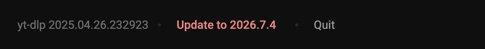

<div align="center">


# YT Channel Scraper

**Browse any YouTube channel's back catalogue in one list, tick the videos you want, and download them in a batch.**

A small local web app — Flask + [yt-dlp](https://github.com/yt-dlp/yt-dlp) — that runs on your own machine.
No account, no API key, no cloud.


</div>

---

## Why

`yt-dlp` is excellent, but grabbing *a few specific videos* from a channel means either downloading
everything or copying URLs one at a time. This puts the channel in front of you as a browsable list —
thumbnails, durations, view counts — so you can pick.

## What you get

| | |
|---|---|
| **Whole channel, one list** | Videos, Shorts, Live streams or Music, with thumbnails, durations and view counts |
| **Results while you wait** | Videos stream into the page as they're found, not after the whole channel is walked |
| **Paged** | 25 at a time, so the first page lands in seconds even on a 5,000-video channel |
| **Batch download** | Tick as many as you like; 3 download at a time with live per-video progress |
| **Quality choice** | Best available, 1080p, 720p, 480p, or audio-only as 192 kbps mp3 |
| **Resilient** | Automatically retries YouTube's intermittent `403`s, which are common and usually transient |


## Install

Needs **Python 3.9+** and **ffmpeg** (to merge video + audio and to make mp3s):

```bash
brew install ffmpeg          # macOS — or apt install ffmpeg, etc.

git clone https://github.com/d4vid4nderson/yt-channel-scrapper.git
cd yt-channel-scrapper
./run.sh
```

`run.sh` creates a virtualenv and installs Flask + yt-dlp on first run, then starts the app at
**http://127.0.0.1:5005**.

## Or build it as a Mac app

```bash
./build-app.sh
```

Produces `dist/YT Channel Scraper.app` and a `dist/YT Channel Scraper.dmg` (~58 MB). Drag it to
Applications and double-click — no terminal, no Python, no Homebrew. It starts the server on a free
port, opens your browser at it, and keeps no Dock icon; **Quit** in the bottom-left of the page is
what stops it. Downloads go to `~/Downloads/YT Channel Scraper`.

The build stages a **static** ffmpeg into `vendor/` rather than reusing Homebrew's, which links ~18
Homebrew dylibs and so would only run on a Mac that already had it installed. First run downloads
those binaries (~91 MB, cached); rebuilds are offline.

**Keeping yt-dlp current matters.** YouTube breaks yt-dlp every few weeks, so the version frozen at
build time will eventually stop working. **Check for updates** in the page footer fetches the current
release from PyPI and unpacks it to `~/Library/Application Support/YT Channel Scraper/lib`, which
loads ahead of the bundled copy on next launch.



A bad update falls back to the bundled version rather than failing to start, so a broken download
can't leave you with an app that won't launch. Rebuilding always picks up the latest release.

The bundle is ad-hoc signed, which is enough for a Mac that built it. Handing the DMG to someone else
means either a Developer ID plus notarisation, or they right-click → **Open** the first time.

## Use it

1. Paste a channel URL — `https://www.youtube.com/@channelname`, a bare `@handle`, or a playlist URL.
2. Pick the type: **Videos**, **Shorts**, **Live** or **Music**. Click the type pill and the menu
   slides out from under the search bar; click an option and it slides back with the pill relabelled.
3. **Scrape.** Results stream in; **Load 25 more** pulls the next page.
4. Tick what you want (filter by title, or **Select all**), choose a quality, **Download selected**.
5. Progress appears in the Downloads panel. Finished files land in `downloads/`, named
   `Title [videoid].mp4`, and each row's progress ring turns into a save button.


## How it works

- **Scraping** uses yt-dlp flat extraction with `process=False`, so the entry list stays a lazy
  generator and videos can be pushed to the page as pages load (~30 per 0.6s) rather than after the
  entire channel has been walked.
- **Pagination** pauses the worker every 25 videos *while holding its place in that generator*, so
  **Load more** continues where it stopped instead of re-walking the channel.
- **Music** tries `/releases` (artist channels) and falls back to `/playlists`. Both list albums
  rather than videos, so those entries get expanded one level to reach the actual tracks.
- **Progress** is combined across streams. A merged download is two passes — video, then audio —
  each reporting 0–100% of its own file, which would fill the bar twice. Each job probes once to
  read `requested_formats`, then reports bytes against the combined total, so it fills once.
- **Retries**: every job re-extracts and retries up to 3 times with a backoff.
- **The type drawer** is a custom control, not a `<select>`, so it can animate: clicking the pill
  slides the menu down from under the search bar over ~0.16s while it fades in, and the chevron
  flips. The label sits in a fixed-width slot so the pill doesn't resize as you change the selection.
- **Downloads panel** shows as a centred modal over the results list, and as a bottom
  drawer on the landing page where there's no list behind it to sit over.
- **Remove one job** by swiping its row to the left — a drag anywhere on the row, or a two-finger
  trackpad swipe — which swaps its ring for a clear button. Swiping back puts the ring away.
  Removing a job that's still downloading actually aborts it — the progress hook raises
  when it sees the id in `CANCELLED` — rather than letting it finish out of sight.

Quality presets are yt-dlp format strings in `FORMATS` (`app.py`) if you want to change them.

## Notes and limits

- **Local only.** It binds to `127.0.0.1` and has no authentication — don't expose it to a network.
- Job state is in memory: restarting the server clears the download list. The files stay.
- If a file of the same name already exists in `downloads/`, yt-dlp skips it and the row completes
  instantly. Delete it first to re-fetch at a different quality.
- Age-restricted and members-only videos will fail on their row. The usual fix is passing browser
  cookies — add `"cookiesfrombrowser": ("chrome",)` to the `opts` dict in `_worker`.
- Only download content you have the rights to. Respect YouTube's Terms of Service and copyright.

## Layout

```
app.py                    Flask app: scrape/pagination endpoints, download queue, worker threads
templates/index.html      Whole front end — markup, CSS and JS in one file, no build step
run.sh                    Creates the venv on first run, then starts the app
build-app.sh              Builds the .app and DMG: stages ffmpeg, freezes, signs, packages
YT Channel Scraper.spec   PyInstaller bundle definition
vendor/                   Static ffmpeg + ffprobe, fetched by build-app.sh (gitignored)
downloads/                Where finished files land when run from source (gitignored)
```

Running from source and running as a bundle differ in three places, all in `app.py`: where downloads
go, whether ffmpeg comes from `vendor/` or `PATH`, and whether the port is fixed at 5005 or picked
free with the browser opened for you. `sys.frozen` is the switch.

## Built with

[Flask](https://flask.palletsprojects.com/) · [yt-dlp](https://github.com/yt-dlp/yt-dlp) ·
[ffmpeg](https://ffmpeg.org/) · vanilla JS and CSS, no framework
